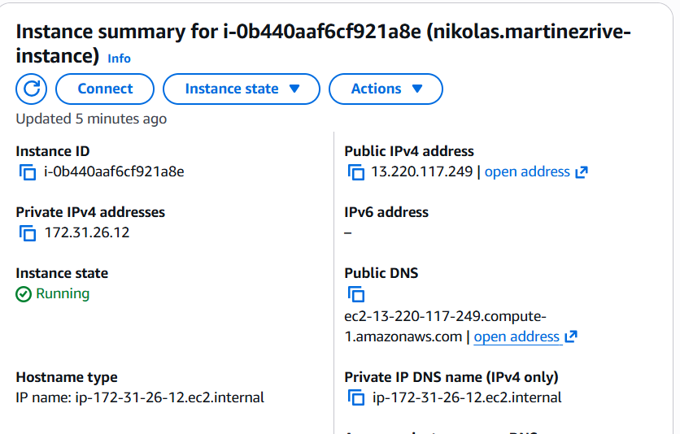
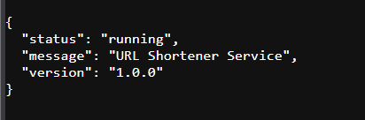
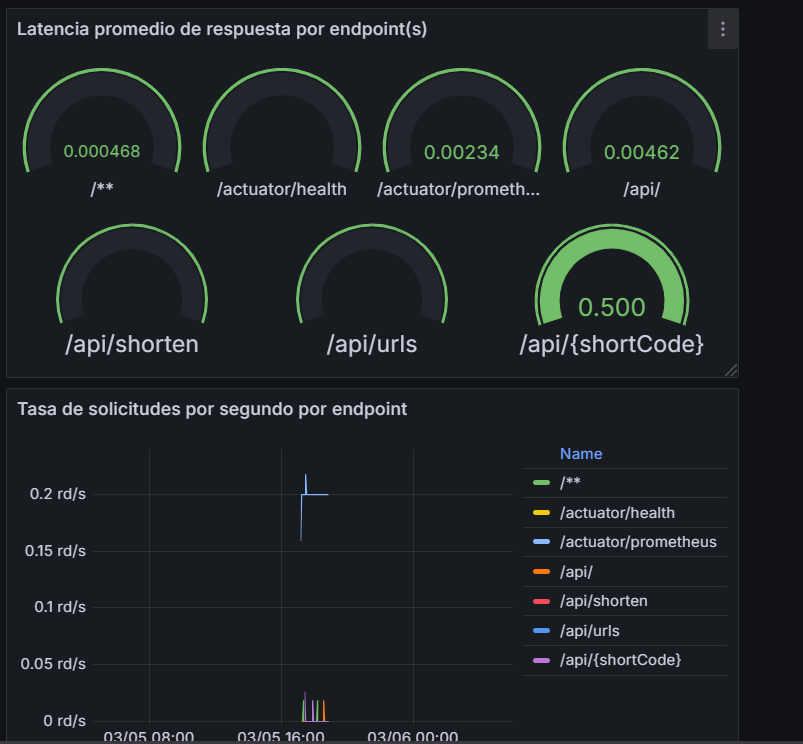
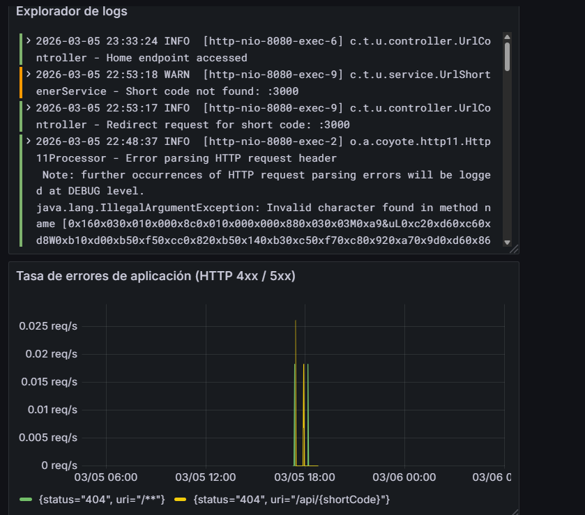
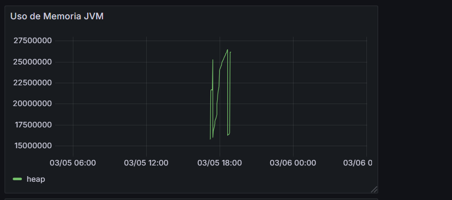
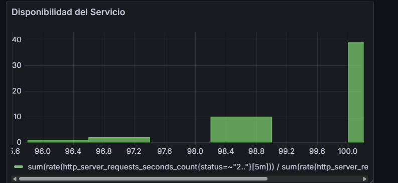

# Bitácora Experimento - Observabilidad y Monitoreo

**Nombre del estudiante:** _____________________________  
---

Cuando acabes no olvides ayudarnos evaluando tu ⭐[experiencia](https://forms.office.com/r/US1LARPmec)⭐

## Tabla de Contenidos
- [Etapa 1: Preparación del Ambiente](#etapa-1-preparación-del-ambiente)
- [Etapa 2: Métricas Iniciales](#etapa-2-métricas-iniciales)
- [Etapa 2.1: Dashboard Base en Grafana](#etapa-21-dashboard-base-en-grafana)
- [Etapa 2.2: Propuesta de Métrica Personalizada](#etapa-22-propuesta-de-métrica-personalizada)
- [Etapa 3: Experimentación y Análisis del Sistema](#etapa-3-experimentación-y-análisis-del-sistema)

---

## Etapa 1: Preparación del Ambiente

### 1.1. Información de la instancia EC2



### 1.2. Verificación del despliegue

**¿La aplicación se desplegó correctamente?** 

- [x] Sí
- [ ] No

**Captura de pantalla de la aplicación funcionando:**

> 

### 1.3. Observaciones y problemas encontrados (opcional)

No hubo xdd


```

---

## Etapa 2: Métricas Iniciales

### 2.0.1. Generación de tráfico

**Endpoints probados:**

- [ ] `GET /api/`
- [ ] `POST /api/shorten`
- [ ] `GET /api/{shortCode}`
- [ ] `GET /api/urls`


### 2.0.2. Análisis de dos métricas relevantes

#### Métrica 1

**Nombre de la métrica:**  
```
http_server_requests_seconds_max gauge

```

**Tipo de métrica:** 
- [ ] Counter
- [X] Gauge 
- [ ] Histogram 
- [ ] Summary

**Descripción de qué información aporta:**
```

Lo maximo que se demoro una peticion en tener una
respuesta en un periodo de tiempo

```

**Relación con otras métricas (si aplica):**
```

Pues vi que puede tener relacion con que El Garbage Collector está pausando la JVM o que
El pool de conexiones a BD está agotado, o en general un servicio 
externo esta respondiendo lento.

```

**¿En que escenarios puede ayudar esta métrica?**
```

Aguantar en picos de trafico puedo escalar servicios que esten respondiendo
lento por lo saturados, o identificar ugares que necesitan optimizacion

```

**¿Qué etiquetas (labels) se utilizan para agrupar los datos?**
```
 uri, method, status, outcome, exception, application.

```

---

#### Métrica 2

**Nombre de la métrica:**  
```
http_server_requests_seconds
```

**Tipo de métrica:** 
- [ ] Counter
- [ ] Gauge 
- [ ] Histogram 
- [X] Summary

**Descripción de qué información aporta:**
```
Registra la distribución completa de los tiempos de respuesta
de las peticiones HTTP. Se compone de 3 sub-métricas:

_count → cuántas peticiones ocurrieron en total
_sum   → tiempo total acumulado de todas las peticiones
_max   → el peor tiempo de respuesta en una ventana deslizante

Juntas permiten calcular promedios, tasas de error y
detectar tanto tendencias generales como picos puntuales.
```

**Relación con otras métricas (si aplica):**
```
Un aumento en _count sin que _sum crezca proporcionalmente
indica más tráfico pero tiempos estables, el sistema aguanta.

Un aumento en _sum sin que _count crezca indica que cada
petición está tardando más, señal de degradación progresiva
aunque el volumen sea el mismo.

Un aumento en http_server_requests_seconds_count{status="500"}
podría elevar el _sum, ya que los errores suelen tardar más
por rollbacks, reintentos o logs extensos.
```

**¿En que escenarios puede ayudar esta métrica?**
```
Si después de un deploy el promedio (_sum/_count) sube de 0.2s
a 0.95s manteniendo el mismo volumen de tráfico, permite detectar
que el deploy introdujo una regresión antes de que lleguen quejas.

Si el _count de status="500" representa más del 2% del total
de peticiones, permite identificar que la tasa de errores está
rompiendo el SLA y actuar antes de que escale el problema.


```

**¿Qué etiquetas (labels) se utilizan para agrupar los datos?**
```
uri, method, status, outcome, exception, application.

```

---

## Etapa 2.1: Dashboard Base en Grafana


### 2.1.1. Evidencia: Dashboard Base en Grafana con los 4 paneles iniciales

**Captura de pantalla del dashboard:**




### 2.1.2. Visualizaciónes Adicionales (Con las metricas actuales)

```
#### Visualización Adicional 1

**Propósito:**
Analizar el consumo de memoria Heap de la JVM en tiempo real.
Permite detectar memory leaks, crecimientos sostenidos de memoria
o momentos donde el garbage collector no libera suficiente espacio.
Métrica usada: jvm_memory_used_bytes


**Título del panel:**
Uso de Memoria JVM (Heap)


**Consulta (PromQL o LogQL):**
sum by (area) (jvm_memory_used_bytes{area="heap"})


**Tipo de visualización:**
- [x] Time series
- [ ] Gauge
- [ ] Bar chart
- [ ] Stat
- [ ] Logs
- [ ] Otro: _____

**Otros ajustes aplicados (colores, unidades, etc.) (opcional):**
- Unidades: bytes (Grafana lo convierte automáticamente a MB/GB)
- Color: naranja con threshold al 80% del heap máximo
- Leyenda: activada mostrando "area"
- Actualización: cada 30s


**Captura de pantalla:**

 

**Análisis (2-3 frases):**
Este panel muestra cuánta memoria Heap está consumiendo la JVM a lo largo del tiempo.
Un crecimiento sostenido sin bajadas puede indicar un memory leak en la aplicación.
Las caídas bruscas corresponden a ciclos del garbage collector liberando memoria.


---

#### Visualización Adicional 2

**Propósito:**
Medir en tiempo real qué porcentaje de las requests HTTP terminan
exitosamente (códigos 2xx), funcionando como un SLI de disponibilidad.
Métricas usadas: http_server_requests_seconds_count


**Título del panel:**
Disponibilidad del Servicio (% éxito)


**Consulta (PromQL o LogQL):**
sum(rate(http_server_requests_seconds_count{status=~"2.."}[5m]))
/
sum(rate(http_server_requests_seconds_count[5m])) * 100


**Tipo de visualización:**
- [ ] Time series
- [x] Gauge
- [ ] Bar chart
- [ ] Stat
- [ ] Logs
- [ ] Otro: _____

**Otros ajustes aplicados (colores, unidades, etc.) (opcional):**
- Unidades: percent (0-100)
- Thresholds: rojo < 95%, amarillo 95%-99%, verde >= 99%
- Rango: mínimo 0, máximo 100
- Actualización: cada 15s


**Captura de pantalla:**



**Análisis (2-3 frases):**
Este gauge muestra de un vistazo qué tan saludable está el servicio en términos de requests exitosas.
Si el porcentaje baja del 99% se puede cruzar con el panel de errores HTTP para identificar
si el problema es puntual en un endpoint o afecta toda la aplicación.
```

### 2.1.3. Análisis final del dashboard

**¿Qué otros datos te gustaría visualizar si tuvieras más información disponible?**
```

1. Tasa de errores por usuario o sesión

2. Tiempo de respuesta de la base de datos por query

3. Tamaño y tiempo de procesamiento de los requests por endpoint

```

---

## Etapa 2.2: Propuesta de Métrica Personalizada


### 2.2.1. Análisis y propuesta de la métrica propia (en Java)

**1. Nombre de la métrica:**
```
Ejemplo: url_shortener_urls_created_total

```

**2. Tipo de métrica:**
- [ ] Counter
- [ ] Gauge

**3. ¿Qué comportamiento mide?**
```


```

**4. ¿Por qué es relevante para el sistema?**
```


```

---


### 2.2.3. Visualización en Grafana

**1. ¿Qué tipo de panel usaste en Grafana?**

- [ ] Time series  
- [ ] Gauge  
- [ ] Stat  
- [ ] Bar chart  
- [ ] Otro: _____

**2. ¿Qué consulta PromQL vas a utilizar?**
```promql


```

**3. ¿Cuál es el propósito de la visualización?**
```
Provee una interpretación en palabras con el propósito de la visualización. Que te interesa ver en el panel?


```


---

### 2.2.4. Panel creado en Grafana

**Captura de pantalla del panel en Grafana:**

> _[Inserta aquí la imagen del panel mostrando la métrica visualizada]_

---

## Etapa 3: Experimentación y Análisis del Sistema

### 3.1. Detección de anomalías y puntos de interés

**1. Como describirias la anomalía?**

```


```

**2. Que paneles te ayudaron a identificarlo?**

``` 


```

**3. Cual podria ser la causa de la anomalía?**

``` 


```

**Captura de pantalla del dashboard mostrando la anomalía:**

> _[Inserta aquí la imagen]_

---

### 3.2. Intento de corrección de anomalías


#### 3.2.1. Modificación del código

**Descripción del ajuste realizado:**
```
Describe en pocas palabras el ajuste realizado.


```

#### 3.2.2. Resultados después del despliegue

**¿El ajuste surtió efecto?**
- [ ] Sí 
- [ ] No 
- [ ] Parcialmente


**Captura de pantalla del dashboard después del ajuste:**

> _[Inserta aquí la imagen del estado del dashboard posterior al ajuste]_

---

### 5.7. Reflexión final

**¿Qué panel te resultó más útil para detectar problemas?**
```


```

**¿Qué métrica aporta mayor valor para monitorear un sistema real?**
```


```

**¿Qué agregarías o mejorarías en tu dashboard?**
```


```

**Fin de la bitácora**
